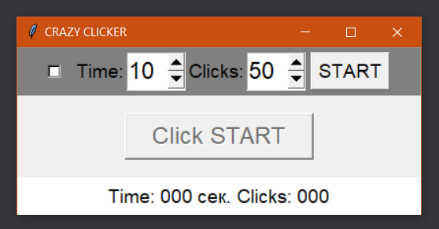

# Crazy Clicker game

[](https://lbesson.mit-license.org/)

[](https://www.python.org/downloads/release/python-360/)

Game for training agility and speed of pressing the button. The goal of
creation this game was gaining practical experience of implementing MVC pattern
to build window-application with __Python__ and __Tk__


## Interface description

To win you need to have time to press the button a specified number of times
within a specified number of seconds.
It is also possible to complicate the game by using a mode in which the button
moves randomly over the window surface.


## Usage
Run in command line:
    
    python crazy_clicker_game.py


### Contributing
Install dependencies to run tests and linters
1. Create virtual environment: `python -m venv .venv`
2. Activate virtual environment:
    - in linux: `source .venv/bin/activate`
    - in windows: `.venv\Scripts\activate.bat`
3. Install development requirements: `pip install -r requirements-dev.txt`
4. Run unittests and linter:
    ```
    flake8
    pytest
    ```


## TODO & Changelog:
### Upgrade from v1.0.0 to v1.0.1
- [x] Implement controller
- [x] Gain 40% of code coverage 
- [x] Add CI/CD

### Upgrade from v1.0.1 to v1.0.2
- [x] Move all testing configuration to `tox.ini`
- [ ] Add MyPy static type checker

### Upgrade from v1.0.2 to v1.0.3
- [ ] Add gathering statistics
- [ ] Add testing against multiple version of Python